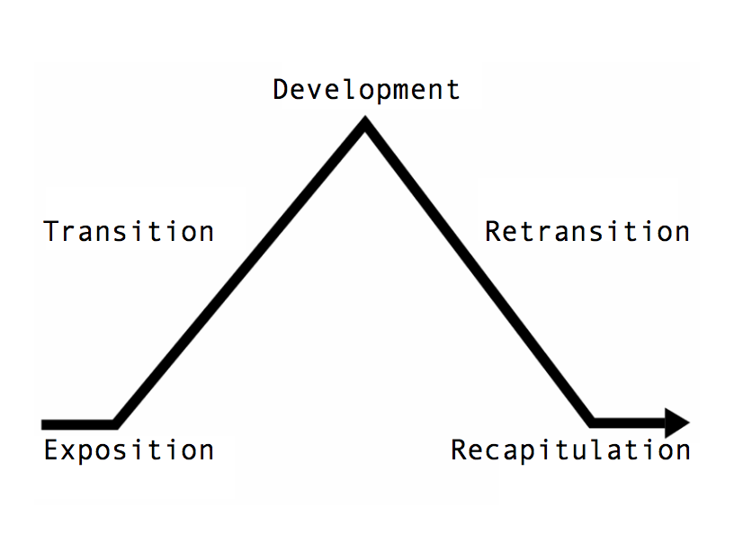
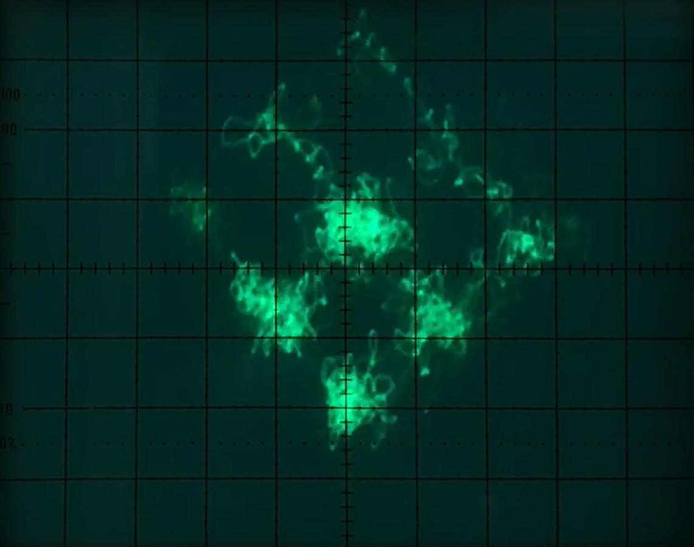

+++
title = "The Genius of Portal 2 Soundtrack"
date = 2026-04-12
description = "Analysis of Portal 2 soundtrack as a three-act tragedy governed by a classical sonata form built out of a fusion of symphonic sounds and industrial IDM"

[taxonomies]
tags = ["music", "videogame", "sound", "puzzle"]
+++

Most video game soundtracks accompany a story. But in Portal 2, the music takes the stage: it *is* the story. In this article, I will break down the score of Portal 2 as a pinnacle of theatric symphonic procession. I will not be going deep into musical chords and their progression; this article is written up to date with the modern approach to music where harmony transcends 12-tone notation, but the _structure_ remains relevant.

Beneath the industrial hums, mangled chiptunes, and the ironic pop closure, lies a monumental work of staggering formal sophistication: a symphonic suite, an opera that unfolds across 3 discs representing 3 acts of a whole, governed by leitmotifs as rigorously developed as anything in Wagner or Beethoven, yet rendered entirely in the language of machines.

Mike Morasky, the composer behind pseudonym Aperture Science Psychoacoustic Laboratories that Valve used for publishing the official soundtrack, constructed a sonata-form tragedy in which the protagonist is not Chell, but the facility itself; a decaying orchestra of steel and silicon, trapping human orchestral sound inside of its electric hubris, which then re-emerges as victorious in the grand finale. *Or does it?*

## Portal 2 as an Opera

Sonata-Allegro form is a structural logic that governed Western music since the mid-18th century, which represents a blueprint by which [programmatic music](https://en.wikipedia.org/wiki/Program_music) is built. It is pretty intuitive, and divided into three phases:

1. **Exposition:** in the opening, the composer usually presents two primary themes and establishes the context of the conflict that is about to be presented. ~~Because, of course, conflicts are all western music is about.~~
2. **Development:** the composer takes themes presented in the exposition and breaks them, fragments them, transposes, modulates, collides against one another, and stretches to their breaking point.
3. **Recapitulation:** the final part usually returns to themes from exposition, and formally, played in home key. This phase usually ends with a _coda_ (literally the "tail") that reinforces the resolution, or offers one last look at a theme in most triumphant or tragic form.

This is the skeleton to the structure of programmatic music, and Portal 2 leans heavily on this classical formula. Although modern music writing tends to neglect properness in this respect - and to a fault, because neglecting it results in un-memorable soundtracks - it is possible to discover that still a lot of soundtracks to some degree follow this formula. Because it _kind of makes intuitive sense,_ if you are trying to tell an emotional story through music, you are very likely to inadvertently fall within this cycle.

However, Portal 2 is not a single movement of a symphony, but an entire grand opera. And it totally does not just pretend to be one:

- *GLaDOS is prima donna, soprano.* She commands the stage and has her own lamenting aria.
- Wheatley is basso buffo, the clumsy comic villain.
- Cave Johnson is the ghostly baritone, as his presence is felt throughout the narrative.

The entire cycle of 3 discs of Portal 2 soundtrack, as they were published by Valve, creates a coherent 3-act macro-form that starts with an overture and ends with a grand chorus, preserves leitmotifs (musical themes) and features literal arias. The soundtrack, therefore, is a grandiose experiment on the classical westerm form.

I will comment on most of its tracks and hopefully show how this opera tells us story that, being closely dictated by _libretto_, the script, is not just accompanying the picture, but makes it work in the first place.

## Act 1: L'Antefatto

The first disc, which is the first major act in the soundtrack, starts with an overture that is a triptych of introductions:

1. A heroic ostinato *"Science is Fun"* that establishes cold, synthetic, calculated momentum of the Aperture facility, and introduces a proleptic thematic statement, a spoiler: the adagio of *"Your Precious Moon"* embedded in its second half, whose tragic meaning is only realized at the very end of the entire cycle.
2. *"Concentration Enhancing Menu Initializer"* which provides a reused textural bridge that presents us with the reality of a decaying, malfunctioning complex. It is also a secondary menu theme that hovers in a harmonic vacuum, acts as a palate cleanser and tonal modulation for the second thematic statement of the overture.
3. The track *"9999999"* which is also the initial main menu when the game is launched for the first time. It presents us with a majestic leitmotif familiar from later *"Music of the Spheres"*, although the actual track appears only in the second disc: the overarching anthem of Aperture Science's hubris, violently mangled, struggling to survive beneath a suffocating blanket of erratic flitching of a synthesizer.

*"Science is Fun"* is a book example of the overture. It is also quite loud for being the first drop: that is precisely the job of the overture, to silence the audience and introduce the main leitmotif. Morasky honors this tradition brilliantly, granting us a prophetic glimpse of the finale's catharsis before the curtain has even truly rise, setting course for a cyclical destiny. He then introduces the second major leitmotif, which is exactly what a classical exposition demands. Now, we have two primary themes, and they will determine the entire conflict.

### The Awakening

The fourth track pivots from abstract exposition to narrative development with *"The Courtesy Call"*, a suite-like awakening of the protagonist in a stasis chamber that immediately transitions into violent episode with Wheatley. Heavy, metallic synth-brass stabs begin to blare out, followed by arpeggio representing the colossal, indifferent scale of Aperture's machinery. Morasky scores the physical destruction of the room, flawlessly translating physical comedy and sheer terror into the language of industrial electronica. Rising from the debris, it also returns a hauntingly isolated miniature statement of the "Your Precious Moon" leitmotif, reinforcing the inevitability of the narrative through structural foreshadowing.

The next two tracks in the disc are an environmental exposition. *"Technical Difficulties"* and *"Overgrowth"* are the textural scene-setting of a decaying stage upon which the first act will play out. The grandeur of Aperture Science is completely stripped out and all we hear is severe digital aphasia, followed by harsh, broken minimalism juxtaposed by the eerie atmospheric swell. The music itself is damp, cavernous, and claustrophobic. *Beware of the ghosts!*

As Chell makes her way through the complex, we do indeed find messages from a literal ghost. With *"Ghost of Rattman"* the ambience cracks to reveal bleeding of schizophrenic human element trapped within its walls. It is a terrifying avant-garde realm of *musique concrète*. It tries to defy the orchestration of the primary theme but its true horror is that the track is fundamentally subjugated to it: peeling it back, the backbone of *"Ghost of Rattman"* is not arrhythmic at all, but at its structural core has "Reconstructing Science" leitmotif, before it is even formally introduced. Ultimately, it forces the very terror to keep time with the facility's metronome. The track fades into an accoustic bridge of *"Haunted Panels"* pizzicato.

The tentative, creeping tension is abruptly swept away by chilling electric harmony of *"The Future Starts With You"*, which augments haunting ambience with massive octaves, moving with deliberate, glacial gravity. The jingle in the track's core in its form could be associated with slickness of Aperture, but its substance sounds more like a tomb. Except, *it is not protagonist's tomb.*

And *"There She Is"*. The breathtaking, eerie stillness of the track succeeds the claustrophobic ambience, which subverts the expectation. Rather than mounting horror further, it strikes with calm, profoundly melancholic melody. Mournful, delicate, accompanied by background choir - humanity trapped within GLaDOS. It is, nonetheless, a trap for intents of our tragedy, shattered by apocalyptic grandeur of *"You Know Her?"* when Wheatley and Chell open the Pandora's box, which culminates in a percussive march as the antagonist awakens. The queen is back on her throne, the board is set, and the suite transitions into relentless, algorithmic development section.

What follows next is a set of tracks that remind us of so-called Intelligent Dance Music (IDM) and resemble fundamentalists of the subgenre like Autechre. Nonetheless, they are not an exclusion from our opera form - they represent _recitative_, the primary plot mover for this act.

### The Testing

The human orchestra is entirely replaced by intense fragmentations, modulations, and harmonic tensions, and the music is intrinsically designed to be tied to player's physical location and momentum. As Chell interacts with the environment, new rhythmic stems, synthesized arpeggios, and percussive layers are dynamically injected into the mix. This is not just a dance to the machine's music, the machine is forcing the protagonist to *compose* it, but only according to its own rigid inescapable tempo. The human element is completely subsumed by the grid. Although all tracks of this sections are kind of boppers, unique and catchy.

The twelveth track of the disc, *"The Friendly Faith Plate"*, is a staccato scherzo that kicks off this sequence. In classic form, a scherzo is traditionally a light, fast-moving, and playful movement. Here, it is dripping with synthetic, calculated malice. Rapid, bouncy, tightly quantized electronic sound perfectly mimics the physical mechanism of the catapults, and the schizophrenic clash of synthetic joy and dizzying fight for survival.

> *"Look at you. Sailing through the air majestically. Like an eagle. Piloting a blimp."* - GLaDOS

Next track completely inverts its predecessor. *"15 Acros of Broken Glass"* consists primarily of menacing sub-bass pulse, heavily textured with the rhythmic metallic scraping and drowning grinding lead, radiating pure electrical dread. This track is also important structurall and still stays in line with common classical patterns, except involves no orchestra at all - it plunges into what could otherwise be the lower strings and heavy brass section that builds subterranean tension before a major thematic shift, which comes in fourteenth track: *"Love as a Construct"*.

Bouncy body changes in *"Love as a Construct"* that is the _aria_ in this section associated with Chell. Except, naturally, Chell has no voice, so instead we get a low-tempo glitching intermezzo that no longer presents a palpable physical threat, but a more insidious weapon: psychological warfare. The track encodes *"Cara Mia Addio"*, the song of turrets from the very ending of the game, but this might as well be the apex of toxicity that GLaDOS exhibits throughout the testing so far: her facility is not just an orchestra of steel, but a panopticon, in which human soul itself is trapped and the jailer continuously hurls highly personal insults regarding Chell's weight, intelligence, and her status as an unloved orphan. The music becomes weaponized through its own cheerful indifference that refuses to validate the suffering. Morasky denies the player this emotional catharsis. This is followed by fifteenth track *"I Saw a Deer Today"* which returns to bouncy yet acoustically unstable character with its generative rhythm, but the synthesizers are heavily, almost nauseatingly detuned - there might as well be only hopeless madness down there.

Sixteenth track is a absolute standout, and it is in my opinion a uniquely beautiful track. *"Hard Sunshine"* has blinding, incandescent force. Morasky has a Johannes Kepler's *Harmonice Mundi* moment here: this track achieves a total synthesis of visual, mechanical, and acoustic modalities, because the track itself creates a beautiful grid-like [Lissajous pattern](https://en.wikipedia.org/wiki/Lissajous_curve) on oscilloscope. The music is most powerful when standing beneath the hard light bridge in the game.

> *"It would also set your hair on fire, so don't actually do it."* - GLaDOS

It is the sound of an omnipotent machine celebrating its own ability to render the world as a series of flawless, interlocking functions. The facility moved beyond gaslighting the protagonist and now projects power by demonstrating that it has total, granular control over the mathematical reality. The track simultaneously also encodes *"Cara Mia Addio"*, similar to *"Love as a Construct"*.

The next track, seventeenth track of the first disc, is a fracture in that monolith of power, *"I'm Different"* is a darker track that references a "defective" turret that refuses to fire. This is a thematic subversion that still implies the lethal efficiency and precision of turrets, but motif is not weaponized. For the first time, it signals the coming of the end of the first act in our opera: it is microtonally fragile and feels much smaller. It is tense, but hints that machines are capable of more than just testing the protagonist, whether for better or worse.

The rest of disc is a mixture of themes and tunes that are not as developmentally important, but worth listing for completeness and remain a perfectly acceptable part of the recitative section:

- *"Adrenal Vapor"* is a minimalist ostinato of 3 oscillators asynchronously playing ascending patterns that maintain tension through persistence of its synthetic friction.
- *"Turret Wife Serenade"* is associated with singing turrets easter egg, but it is itself an aria that stays authentic to the whole.
- *"I Made It All Up"* is a bonus track that also is a main menu theme after the ending.
- *"Comedy = Tragedy + Time"* is a dense, airless track, although it does not by itself say anything new beyond what was already said.
- *"Triple Laser Phaser"* as the final track of disc that is similarly to *"Adrenal Vapor"* a procedural polyphony of three "laser-like" oscillators.

I could interpret this tail of tracks as facility's logic at a dead end, but in truth, we don't really get a formal closure for this section, the exposition is left open-ended. This is likely just a tail of tracks that are less structural to the narrative and so come out as a thematic thinning, before the next act of the opera.

## Act 2: La Peripezia

The second disc begins with a new heroic ostinato, *"You Will Be Perfect"*, which serves as a prelude for the new act, as popularized in opera genre by Richard Wagner, and also transitions from confident opening into the recurring thematic block of *"Your Precious Moon"*, serving as a reprise of the exposition after an implied pause between acts. Naturally, because we are no longer in the exposition, we don't get any secondary introduction - the second track resumes at the finale of disc 1 with *"Halls of Science 4"* consisting entirely of synthesized minimalist sound. From here, we are thrown into a complex recitative of the second act that continues on topics already established in the first act.

The third track, *"(Defun Botsbuildbots () \[Botsbuildbots) ]"* is a deliberate Lisp programming expression with a syntactical error, which encodes the track's narrative in its name: it is a non-terminating recursive function, but it is malformed. The track starts with the leitmotif, before heavy industrialized electric sound completely overtakes the track. In general sense, the entire disc 2 maintains a more dynamic IDM-like character, but remains a development of the topic. We are no longer in the exposition part of our opera, the stage is already set. Simultaneously, in this act, a much more pronounced emphasis is placed on the *"Music of the Spheres"* leitmotif that was first introduced in *"9999999"* - the leitmotif, in fact, will be very important in the second part of this disc.

But let's not jump ahead of ourselves; before we get to that, we get to face the first peak of development section.

### The Betrayal

Fourth track of the second disc, *"An Accent Beyond"*, is associated with the episode in which Wheatley starts to to get its voice in the story by leading Chell through the backstage of Aperture to begin the sabotage. It has this "heist" vibe to it; abandons sterile, puppeteered perfection of the testing chambers and sounds decidedly manual and driving.

But the success is met with an again ominous *"Robot Ghost Story"*, which itself is also a classical move: a dark premonition before the tragic reversal of fortune that strips away the illusion of control that the "heist" track provided. An omen of the impeding climax, and that the story is very far from over. It plunges us again into an ambient dread reminiscent of the first disc's exposition, reminding us that the backstage of Aperture is vast, ancient, and haunted.

The disc next shatters the vacuum by the hyper-kinetic *"Die Cut Laser Danse"* and it actually introduces a theme of its own that we could hear in glitchy base of *"Love as a Construct"* in the first disc; a glitchy, non-melodic leitmotif. It is easy to miss, because the leitmotif here is not tribal-sounding dancing Karplus-Strong synthesis, but precisely the glitch-groove that starts from the beginning. This autistic tune then suddenly gives way to the surprisingly emotional seventh track *"Turrent Redemption Line"*, replacing the electronic score with an arrangement of brassy strings.

This is where the real most devastating thematic reveal of this entire sequence comes in the eighth track *"Bring Your Daughter to Work Day"*. Amidst the rusted baking soda volcanoes, we find a massive, overgrown potato battery project bearing a single name: *Chell*. The music here is distinct from the rest of soundtrack, electronic, also haunted but not ambient: the protagonist's own history is implicated in the facility's downfall. It fuels endless speculation: was Chell the daughter of an Aperture scientist? Was she trapped here on the very day the facility fell? We are only provided a sparse, chilling gust of wind that reminds us that beneath the layers of steel and test chambers, this mechanical hell was built by nobody else but humans.

The weight of revelation is quickly dismissed and subsumed by the ticking clock and escalating tension of *"Almost at Fifty Percent"* that plays when the player sabotages the neurotoxin generator. It serves as the drumroll before the catastrophic confrontation with GLaDOS. The stage is now fully destabilized and now we are facing the queen, which brings us to the monumental tenth track of the disk: *"Don't Do It"*.

*"Don't Do It"* is again a dynamic mini-suite similar to *"The Courtesy Call"* which opened the story after the curtain was lifted in overture. It opens with a short jingle of an electronic octave, followed by quick buildup of a frantic momentum of the meeting with GLaDOS, only to unexpectedly plateau in a loop with recurring first tact of *"My Precious Moon"* and strings spelling doom of the scene. The acoustic suspension scores the tense, agonizing moments of the core transfer, where the fate of the entire facility is at stake. As we proceed through the scene, the music accelerates and the theme of *"My Precious Moon"* becomes even more complete, and its placement here is devastating: at the exact moment GLaDOS is dethroned and the balance of power shifts, the music reminds us of the ultimate, terminal destiny of the facility, and the overarching tragedy. The score is actively foreshadowing that this is merely another variable in a larger equation, binding the chaotic immediate present to the inevitable, sealed future. Then, the electric orchestra abruptly stops - for a reboot.

As the transfer completes and GLaDOS is violently discarded, we enter an entirely alien theme of *"I Am Not a Moron"*, which represents Wheatley's ascension and it is a complete and sudden departure from the acoustic palette we have been building so far. It has the same Aperture Science energy to it, but it is also very similar to GLaDOS-associated motifs in its distinctness: Wheatley's signature theme is loud, brassy, and bombastic. Initially, it bursts forth as a cheering, triumphant ascension, almost delusional electronic fanfare celebrating the new chapter, but the victory lap lasts only seconds. The harmony then violently curdles, twists into a massive wall of doom. The realization hits the music: Wheatley is not in control of the machine; the machine is in control of him. The euphoric high is crushed by the terrifying reality of the mainframe's inherent toxicity, as it swallows the new conductor of the electric orchestra whole, ending the sequence in a terrifying freefall that changes the stage completely.

### The Hubris

The Wheatley's ascension hurls the symphonic suite not just downwards into the physical depths of the earth, but backward through time. Instead of pristine tones of GLaDOS-era Aperture, we get analog, tape-saturated aesthetic of Cave Johnson's Old Aperture, and this is where the aphorism *Comedy = Tragedy + Time* suddenly gets proven true. Gone are the massive electric octaves and procedural synthesis; in their place, we get glitches combined with muted trumpets, stand-up bass, and dusty percussion, starting with track number twelve *"Vitrification Order"* that sounds like a 1950s thriller, but *heavier*.

As we observe in the remnants of the old complex, time has, indeed, transformed Cave's fatal hubris into a dark comedy. The next track is the long-awaited entrance of the main theme of Aperture: meet the grand, mid-century majesty of *"Music of the Spheres"*, resurrected in its original, uncorrupted form. Pure, unadulterated "cowboy science" of Cave Johnson, a magnificent, swaggering anthem of a company unbounded by logic, safety, or ethics. The music sounds like a recruitment film for a utopian future, but echoes through cavernous, condemned ruins of a literal tomb. It starts with purely orchestral sound, and then suddenly teleports into a mixture of orchestral backbone with electric inserts.

This is some Shakespeare material right here in our opera. Think of Hamlet or Macbeth: the throwback into the past is the "hamartia" moment and its ghost is Cave Johnson, and it is there not just to be scary; it is the inciting force that demands the past be reckoned with. The narrative is being dragged back to the site of the original crime, except is was the dead King who was the murderer of Elizabethan queen. This is kind of funny to think about - but also, it is a very creative study of a post-mortem tyranny. In fact, *"Music of the Spheres"* is the literal murder weapon, as it is _the leitmotif of hubris_.

As we climb through decades layered upon each other, the score charts Aperture's financial and moral decay. It starts smaller than the ambition set in *"Music of the Spheres"* but builds upon it: *"You Are Not Part of the Control Group"* is slower, as is the resources of the shower curtain producing Aperture company that suddenly decided to buy a salt mine and start conducting scientific research in it. The ambition visibly grows in *"Forwarding the Cause of Science"*, but it does not sound quite like the promise made in *"Music of the Spheres"*. Still, this is the same motif, developed across three tracks.

We learn a lot along the way, but this time we are not being in a history of our protagonist, but antagonist GLaDOS, who we find among the layers - and for whom we start to develop a weird sort of sympathy. In music, *"Potatos Lament"* halts our climb with an emotional aria in which the dethroned queen of Aperture, now trapped in a potato battery and being pecked by a bird, is granted a literal, operatic lament. Stripped of her massive, reverberating processing power, GLaDOS' voice signs a mournful, humbled, solitary melody. She is no longer the conductor; she's just another piece of trash in Cave Johnson's graveyard.

As we get reunited with potato-incarnated GLaDOS, we return to our theme of hubris in *"The Reunion"*, grander than ever before. As the protagonist and the ex-antagonist continue their ascent in an unholy alliance, we learn the truth about GLaDOS. The name of this one is particularly interesting: it is easy to understand this as the reunion of Chell and the potato AI, but because of prevailing theme of hubris, it might as well be the reunion of Cave Johnson and Caroline, now known as GLaDOS. This is the moment of Anagnorisis, the  tragic hero's realization of their true identity and the nature of their condition. The score moves way beyond hubris, or a simple buddy-cop dynamic between Chell and PotatOS, and turns it into a Shakespearean trans-temporal ghost story. This is the relevation of the full scope of the facility's cyclical curse that the dethroned queen herself was subjected to as a victim, rather than as the offender.

This leads us back through the fire of incendiary lemons to the surface, with the final track of the disc *"Music of the Spheres 2 (Incendiary Lemons)"* concluding the act. Cave Johnson's recorded voice descends into a coughing, unhinged fury, and the reprise of Aperture's theme of hubris turns into a militarized electric frenzy of a man violently rebelling against his own mortality and lack of agency, bridging the crazed megalomania of the facility's founder with the calculating sociopathy of the AI he would eventually order scientists to create by sacrificing the life of his closest assistant, who might also have been the love of his life. Here, the murder weapon that *"Music of the Spheres"* is, is completely covered in blood.

## Act 3: La Catastrofe

Once again, disc 3 gets an opening prelude, *"Reconstructing More Science"*, which in its extended form as released in the soundtrack includes a very comprehensible but restrained *"My Precious Moon"*. This time - in a form that also makes the inspiration abundantly clear: adept listener might recognize that this is a homage to a particular episode of 1st movement of Beethoven's Moonlight Sonata.

{{ audio(src="beethoven.opus") }}

Always have been. In released soundtrack, this touch of clarity reinstates the feeling of inevitability of the resolution that this act will bring to our opera.

### The Tyranny

The first contentful entry is Wheatley Science, an opener to the bastardization of the facility's original testing motifs. We are back to IDM, although this time with a tint of everything we've been through so far. *"Wheatley Science"* is the sound of a toddler violently mashing the keys of a priceless synthesizer; a completely collapsed exposition. Following that, we have *"Franken Turrets"*, in which the music literally limps; Wheatley's grotesque attempt at "inventing" by smashing weighted storage cubes and defective turrets together is scores with a pathetic beat - the mechanical orchestra continues to break down under the strain of its new conductor's stupidity.

The thematic brilliance of Wheatley's era is fully unmasked in the reuse of Bach's Little Prelude No. 2 from the Six little preludes (BWV 934) playing in altered key, also known as *"Machiavellian Bach"*, which is also a small fourth wall break as the music is admitted by characters. In a desperate attempt to project the intellectual superiority he lacks, Wheatley pipes in actual unaltered classical music, only further proving his illegitimacy. The scenery of hilariously pathetic acoustic facade that masks the fact that the nuclear reactor beneath him is actively melting down is brilliant, but the Morasky's arrangement of Bach's work itself here deserves separate acclaim - absolutely one of my favorites.

Amidst this chaotic, blundering plagiarism and mockery, we are suddenly suspended in the ambient, almost celestial calm of *"Excursion Funnel"*, a breathtaking piece of floating synthesized ambiance holding a narrative irony: they are definitely *not* Wheatley's invention. Simultaneously, the next track, *"Test"*, attempts to reinstate the same pristine sound of GLaDOS' test chambers, but the facility simply cannot sustain the illusion: the track is constantly undercut by heavy, brassy, downward octaves that do not allow the melody to develop into anything else. In-game, the episode is punctuated by background explosions and screen shakes. The mechanical orchestra is quite literally falling apart; the metronome is still working but there is no harmony, only warnings and errors. The stage itself is melting, it is clear that this simply cannot continue.

The seventh track starts with a repetition of *"Excursion Funnel" that abruptly* transitions into the seventh track of the disc: *"The Part Where He Kills You"*, and it is the Part Where He Attempts to Kill You. What follows is a dark, aggressive, and deeply synthesized amalgamation of Wheatley's entire arc, a chimera of leitmotifs: driving heist of *"An Accent Beyond"* infected with tyrannic theme of *"Wheatley Science"*, underpinned with the doom string attacks of *"Don't Do It"*. The comedy officially dies here and Wheatley's incompetence is simply not funny anymore. The chase concludes with "OMG, What Has He Done", an interlude that opens with a blaring catastrophic fanfare, followed by a moment of acoustic heartbreak: the brief return of the tragic stillness of the GLaDOS pizzicato from "There She Is" from the first disc. It is quickly replaced by yet another reprise of tyrannical Wheatley Science theme, before decaying into deep, low, tragic cello strings, before exploding into the absolute frenzy.

The *Catastrofe* reaches its zenith in *"Bombs for Throwing at You"*. A desperate, apocalyptic brawl breaks out, and all structure is abandoned in favor of loud survivalist adrenaline. We get no crescendo - the mechanical orchestra just begins to scream. Literal bombs are being hurled across the room. We might have seen this before, at the end of Portal 1 - but not at this BPM. Morasky remains very conscious of this track's mathematical fracture, the track is held together by the synthetic lead screaming "My Precious Moon" as the rest of the track is tearing itself apart from the inside out. The narrative has nowhere to go anymore. This is the end. It has nowhere to go but up, *through the collapsing roof*.

### The Coda

We are finally arriving at the tenth track of the third disc: Your Previous Moon. In classical sonata form, the Coda (literally "tail") is a passage that brings a piece to an end, often expanding upon the central themes to provide a sense of ultimate, harmonic finality. Morasky delivers one of the most strunning structural payoffs not just in video game history, but possibly in the history of music itself since Beethoven.

The sheer genius of this moment lies in its inevitability that was carefully preserved throughout the entire cycle. The soaring, tragic adagio sweeps over the listener as Chell and Wheatley are sucked into the vacuum of literal space. The same energy of *"Science is Fun"*, *"You Will Be Perfect"*, *"Reconstructing Science"*, and *"Don't Do It"*. The proleptic thematic statement from the beginning comes to a final bloom, acquires its complete meaning, manifests into its fully realized form. The tragedy *was* written into the cycle's DNA from the start. One of Cave Johnson's greatest hubris was purchasing millions of dollars of lunar rocks, which ended up poisoning him, bankrupted his company, and necessitated the creation of GLaDOS to carry on his legacy - but the same moon rocks are the perfect protal conductor. The moon birthed the entire story of this facility as we experience it, and the moon provides its closure. The score told us this, the entire time.

Finally, silence. The cyclic curse of Aperture Science is ripped out of the earth and suspended in orbit. The tragecy has reached its perfect, inescapable finale. *Or did it?*

It is legitimately hard to say. Instead of a triumphant resolution to the coda, we get a tense dialogue with reinstated queen. Having experienced the Anagnorisis of her human origin, GLaDOS makes her final, chilling move: announces the deletion of Caroline. The moment is factually present in *"Caroline Deleted"*, the eleventh track. Once again, we get the electric octaves jingle, as we ascend towards the surface, and a clean, authoritative rendition of the *"Reconstructing Science"* motif. The sonata form has seemingly returned to the tonic key of the exposition, and the cycle is reset. The machine is truly a machine, once again.

Nonetheless, we get our catharsis and the true finale to our symphonic form in *"Cara Mia Addio"*, universally known as the Turret Opera. This is a staggering subversion in which the turrets deliver a traditional *a cappella* Italian aria in pure, unadulterated acoustic vulnerability, singing of a "beautiful darling" as a maternal farewell. We get the emotional catharsis that we were so violently denied in *"Love as a construct"* and the ghosts of Aperture Science are finally allowed to mourn.

And yet, it is a song of machines, born by a cynical facility. Just as the protagonist breathes in the "freedom" of the surface, the metal shed behind Chell aggressively ejects a single object: a heavily scorched Companion Cube, the exact one from the first game that GLaDOS forced Chell to incinerate in a grueling act of psychological torture. The illusion of a happy ending is shattered. This is not a peace offering or a friendly souvenir. The mechanical orchestra survived, the facility is reconstructing its science, and the stage is resetting. The protagonist is stranded in an apocalyptic wheat field with the burned corpse of her only "friend", cast out by a colossal, singing calculator that refuses to admit it cared.

The cycle was never broken, simply closed off to the outside world, and all we get is a cynical pop song, and an eternity of perfect, sterile testing in the dark.

(The rest of disk are bonus tracks, or tracks related to Portal 2 Co-op. Formally, they are in the disc, but they no longer contribute to the narrative, similarly to the tail of tracks in the first disc. Similarly, fourth disk is just re-issuance of music from Portal 1)

## Conclusion

Looking at Mike Morasky's work on Portal 2 solely through the lens of video game sound design is a sure way to miss the monumental architectural achievement of its composition. From a music-theoretical perspective, this soundtrack is a master-class in adapting classical and baroque operatic and symphonic structures to the 21st-century medium, with an added cherry on top - procedural electronic music. It is a work that demands to be studied as a rigorously structured classical tragedy.

At the highest structural level, the three-disc soundtrack of Portal 2 functions as a macro-sonata form:

1. **Disc 1: The Exposition** - the dramatic two-fold overture opens both the macro-structure and the act itself, and all songs of a disc establish the primary tonal and rhythmic centers of the work. The exposition plants the proleptic seeds of all further developments as well as coda, in particular the "My Precious Moon" and the "Music of the Spheres" motifs are being introduced early which allows them to acquire semantics throughout the cycle. The mastery over sound in the "IDM" section and the creative use of reactive sampling and looping also commands respect.
2. **Disc 2: The Development** - opens with its own overture that reinstates "My Precious Moon" and develops on established themes, subjecting them to further modulation and friction both harmonically and temporally. In the second part, through the 1950s acoustic grandeur that makes "Music of the Spheres" into an independent upstanding theme, it introduces an interesting Shakespearean twist that is integral for the dramaturgic effect of the recovery after reversal of fortune.
3. **Disc 3: The Recapitulation and Coda** - intentionally disfigured by Wheatley's "conductorship", the recapitulation is unstable, constantly threatening to collapse under its own dissonant weight, until it finally shatters into a truly cathartic Coda, in which the proleptic "My Precious Moon" achieves its ultimate, terrifying manifestation, resolving all the structural tension built over the previous two acts.

Morasky treats his motifs with a rigorous, almost Wagnerian discipline, subjecting them to diminution, stripping of rhythmic drive, or harmonically corrupting. It is a highly teleological composition: every note, from the very first overture, is inexorably being pulled toward the final conclusion that has the sense of inevitability to it. Yet the approach is highly subversive, rendered entirely by machines, yet intentionally employing *Klangfarbenmelodie* (tone-color melody) through synthesis. The set of harmonies can be repeating, but its timbre is deeply progressive. The emotional shifts are achieved by actually manipulating the texture of sound, rather than just changing keys and rhythms. We move from between mathematically pure pulse-width modulation to flawless vector synthesis, to bit-crushed, clipping digital distortion, and eventually, fragile acoustic *a cappella* and arias.

Portal 2 soundtrack weaponizes its own medium, makes the concert hall itself the antagonist, and bends the procedural language of IDM to serve the highest forms of classical tragedy. Beneath the sarcastic dialogue and puzzle mechanics lies a titanic symphony of hubris, moral decay, and survival - a masterpiece that does not just accompany the game, but fundamentally transcends it.
